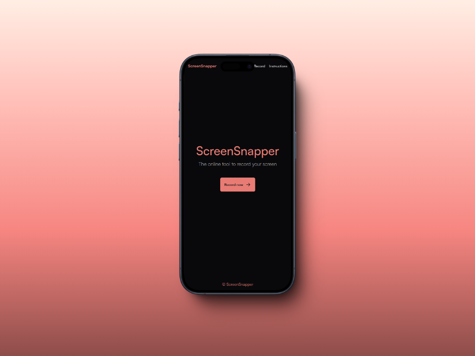
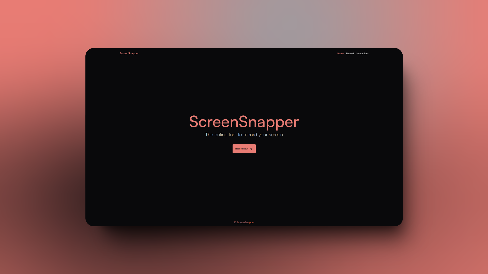

<div align="center">
  <a href="https://screen-snapper.vercel.app" target="_blank">
    
  </a>
  <p>
    <b>
    The online tool to record your screen
    </b>
  </p>
</div>

<details style="margin-top: 20px;">
  <summary>Table of Contents</summary>

- [🖼️ Screenshots](#️-screenshots)
- [🌐 Website](#-website)
- [🚀 Getting Started](#-getting-started)
  - [📚 Dependencies](#-dependencies)
  - [⚙️ Installation](#️-installation)

</details>

# 🖼️ Screenshots

<div>
  
</div>
<div>
  
</div>

# 🌐 Website

If you want to see the website, you can visit [ScreenSnapper](https://screen-snapper.vercel.app).

# 🚀 Getting Started

## 📚 Dependencies

> [!IMPORTANT]
> This project requires **Node.js version 20** or higher.

```bash
# Install pnpm if you don't have it:
npm install -g pnpm
```

## ⚙️ Installation

1. Clone the repository

```bash
git clone https://github.com/alevidals/screen-snaper.git
```

2. Install the packages

```bash
pnpm install
```

3. Execute the project

```sh
pnpm run dev
```